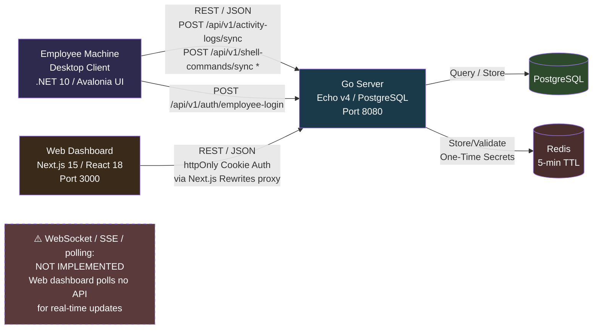

# Alpha AI Tracker — Project Map

> **Last audited:** 2026-07-25  
> **Audit commit:** (not available — working tree was clean at start of audit)  
> **Overall completion (honest):** ~20% across all 3 services (not 5%, but far from production-ready)

---

## 1. Project Overview

Alpha AI Tracker is an employee monitoring and productivity analytics system consisting of three services:

1. **Desktop Client** (`client/`) — Installed on employee machines. Collects process activity, window titles, CPU/memory usage, and shell/terminal commands. Sends data to the central server via REST.
2. **Server** (`server/`) — Go + Echo + PostgreSQL + Redis. Central API hub. Receives and stores client data, exposes admin-facing REST API for the web dashboard. Handles authentication for both web admins and employee desktop clients.
3. **Web Dashboard** (`web/`) — Next.js 15 App Router. Admin-facing UI for viewing employee data, managing departments, generating login secrets, and analytics. Most pages currently render mock localStorage data rather than calling the real API.

---

## 2. System Architecture Diagram



> `*` — `/api/v1/shell-commands/sync` is called by the client but **does not exist** on the server (no route, no table).

---

## 3. Service Breakdown Table

| Service | Stack | Responsibility | Entry Point | Internal Doc |
|---|---|---|---|---|
| **client/** | .NET 10, Avalonia 12.1, CommunityToolkit.Mvvm, Microsoft.Data.Sqlite | Employee-side data collection & sync | `Program.cs`, `App.axaml.cs` | [client/ARCHITECTURE.md](./client/ARCHITECTURE.md) |
| **server/** | Go 1.25, Echo v4.15, pgx v5.10, go-redis v9.21 | Central API hub, data storage, auth | `cmd/server/main.go` | [server/ARCHITECTURE.md](./server/ARCHITECTURE.md) |
| **web/** | Next.js 15.3.4, React 18, Redux Toolkit, TanStack Query | Admin dashboard & analytics | `next.config.ts`, `src/app/layout.tsx` | [web/ARCHITECTURE.md](./web/ARCHITECTURE.md) |

---

## 4. Cross-Service Contracts

### Client ↔ Server

| Direction | Protocol | Auth Method | Format |
|---|---|---|---|
| Employee login (client → server) | REST POST `/api/v1/auth/employee-login` | emp_id + secret_key (Redis-validated) | JSON `{employeeId, secretKey}` → `{employee, token}` |
| Employee disconnect | REST POST `/api/v1/auth/employee-disconnect` | JWT token in body | JSON `{employeeId, token}` |
| Activity log sync (client → server) | REST POST `/api/v1/activity-logs/sync` | JWT token in request body | JSON `{employeeId, token, logs: [...]}` |
| Shell command sync (client → server) | REST POST `/api/v1/shell-commands/sync` | JWT token in request body | **⚠️ Server endpoint does not exist** |

### Server ↔ Web

| Direction | Protocol | Auth Method | Format |
|---|---|---|---|
| Web admin login | REST POST `/api/v1/auth/login` | email + password → httpOnly cookie | JSON `{email, password}` → sets cookie |
| All web API calls | REST via Next.js rewrites (`/api/*` proxy) | httpOnly cookie (auto-sent) | JSON request/response |

### Contract Documentation

**No formal contract documentation exists** beyond what is implicit in the Go DTO files (`server/internal/dto/`) and the TypeScript API client (`web/src/lib/api.ts`). These are manually kept in sync by the developer — there is no schema generation, OpenAPI spec, or shared type system.

### Inconsistencies Found

1. **Shell commands** — Client sends to `/api/v1/shell-commands/sync`. No server endpoint or DB table exists.
2. **Employee disconnect** — Client sends `POST /api/v1/auth/employee-disconnect` with `{employeeId, token}`, route exists on server.
3. **Field naming** — Client uses `employeeId` in snake_case for the auth payload, server expects `employeeId` too (consistent). Activity log entries: client sends `processName`, `windowTitle`, etc. (camelCase), server DTO matches. **Consistent by convention, no validation schema enforces it.**

---

## 5. Current Completion State

### Server — ~40% complete

**What works:**
- All 5 migrations run on startup
- Full CRUD for users, employees, departments, activity logs
- Web admin auth (email/password → httpOnly cookie with encrypted JWT)
- Employee auth (Redis one-time secret → JWT token)
- Activity log ingestion and listing with filtering/pagination
- Company admin auto-initialization on first run
- Graceful shutdown

**What's missing:**
- **No tests** (0 test files)
- **No shell commands table or sync endpoint**
- **No rate limiting** on any endpoint (including login)
- **No structured logging** — uses `log.Printf` only
- **No Redis fallback** — if Redis is down, employee auth is completely broken (server warns but doesn't degrade gracefully)
- **No observability** — no metrics, tracing, health check depth
- **No request validation library** — manual field checks in handlers
- **No cleanup job** for old activity logs (data grows unbounded)

### Client — ~35% complete

**What works:**
- Cross-platform process collection (Win/Linux/macOS)
- Shell command history reading (all platforms)
- SQLite local storage with schema
- Encrypted config system (AES-256-GCM, transport→machine key migration)
- Login/logout flow with server
- Log sync every ~5 min
- Auto-start persistence (all platforms)
- Background guard watchdog
- Tray icon (minimize to tray on close)
- Windows power management (prevents sleep)

**What's missing:**
- **No tests** (0 test files)
- **Shell commands sync** — client sends to non-existent server endpoint (silently fails every 5 min)
- **No auto-update mechanism**
- **No crash reporting** — unhandled exceptions crash silently
- **No offline queue analysis** — if server is unreachable, logs buffer locally but with no back-pressure handling
- **No encryption at rest** — SQLite encryption (sqlcipher) is commented out
- **macOS CPU measurement** — macOS process collector skips CPU measurement entirely (always 0%)
- **macOS window titles** — only captures foreground window, missing EnumWindows equivalent

### Web — ~15% complete

**What works:**
- ~30 page routes exist with polished UI
- Login page with animated hero section
- Auth check on mount (Redux + server cookie)
- Users page — real API calls via TanStack Query (CRUD + generate secret)
- Departments page — real API calls (CRUD)
- Logs/Comprehensive page — real API calls
- Sidebar with permission-based filtering (client-side only)
- Dashboard shows mock stats and chart

**What's missing (most pages):**
- **~25 of 30+ pages use mock localStorage data** — not connected to real API
- **Client-side only permissions** — no server enforcement
- **No error boundaries** — uncaught React errors crash the page
- **No loading/empty/error states** on most mock-data pages
- **No real-time updates** — no polling, WebSocket, or SSE
- **No accessibility testing** — many interactive elements lack aria attributes
- **No unit tests** — 0 test files
- **GitHub release download** fetches from `clickmaster4285/Alpha-AI-Tracker`, not the org repo

---

## 6. Global Conventions

*Extracted from observed patterns, not documented anywhere:*

| Convention | Observed Pattern |
|---|---|
| **API versioning** | All routes under `/api/v1` |
| **Error responses** | `{code, message, detail?}` via `dto.APIError` (server) |
| **Auth** | httpOnly cookies for web, JWT in request body for employee clients |
| **Naming (Go)** | PascalCase exports, camelCase JSON fields |
| **Naming (TypeScript)** | camelCase variables, PascalCase components |
| **Naming (C#)** | PascalCase for classes/methods, `_camelCase` for private fields |
| **Soft delete** | `deleted_at TIMESTAMPTZ` on all tables, filtered in queries |
| **Migrations** | Sequential numbered SQL files in `server/migrations/` |
| **Go module** | `github.com/alpha-ai-tracker/server` |
| **Git branch** | Currently on `setup` branch — no PR/branch convention visible |
| **Commit style** | Descriptive lowercase messages: "now remove the exit btn on the tray on windows", "fixit" |
| **Monorepo tooling** | No shared tooling (no Turborepo, Nx, etc.). Each service has its own build system. |

---

## 7. Known Gaps / Risks

### Cross-Cutting

| Gap | Severity | Details |
|---|---|---|
| **Shell commands sync** | 🔴 High | Client sends to non-existent endpoint. Shell command data is lost forever. |
| **No tests anywhere** | 🔴 High | 0 test files across all 3 projects. Any refactor is blind. |
| **No observability** | 🟠 Medium | No structured logging, metrics, tracing. Debugging production issues requires SSH + log scraping. |
| **Client-side only RBAC** | 🟠 Medium | Permissions are enforced only in the web frontend localStorage. A malicious user can trivially bypass them. |
| **No rate limiting** | 🟠 Medium | Login endpoint and activity log sync have no rate limiting. Brute-force / DoS is trivial. |
| **Mock data dominance** | 🟠 Medium | ~90% of web pages use mock data, giving a false sense of completeness. |
| **Default passwords** | 🟠 Medium | `AlphaAI@2024!` is the compiled-in default. Easy to forget to change. |
| **No offline/retry strategy** | 🟢 Low | Client retries sync every cycle but has no exponential backoff or dedup. |
| **Horizontal scaling** | 🟢 Low | Server uses Redis for employee secrets (short TTL), so scaling is straightforward — but DB queries have no query analysis. |

---

## 8. How to Run Locally

### Prerequisites

- Go 1.22+ (tested 1.25), PostgreSQL 16+, Redis 7+
- Node.js 20+, npm
- .NET 10 SDK (for client development with `dotnet run`)
- Docker (optional, for PostgreSQL/Redis)

### 1. Start PostgreSQL and Redis

```bash
# Using Docker (recommended)
docker run -d --name pg -e POSTGRES_USER=alpha_ai -e POSTGRES_PASSWORD=yourpassword -e POSTGRES_DB=alpha_ai_tracker -p 5432:5432 postgres:16
docker run -d --name redis -p 6379:6379 redis:7
```

### 2. Server

```bash
cd server
cp .env.example .env
# Edit .env — set DB_PASSWORD and JWT_SECRET
make setup
make run
# Server starts on http://localhost:8080
```

### 3. Web Dashboard

```bash
cd web
npm install
npm run dev
# Dev server on http://localhost:3000
```

If server runs on a different host, set `NEXT_PUBLIC_API_URL` in `web/.env`.

### 4. Desktop Client

```bash
cd client
# Ensure .env has ALPHA_SERVER_URL=http://localhost:8080
dotnet run
```

### Notes

- No `docker-compose.yml` exists — you must start PostgreSQL and Redis manually.
- The client requires a running server with at least one employee created via the web admin.
- Login to the web dashboard with the default credentials from `.env` (admin@alphai.com / AlphaAI@2024!).
