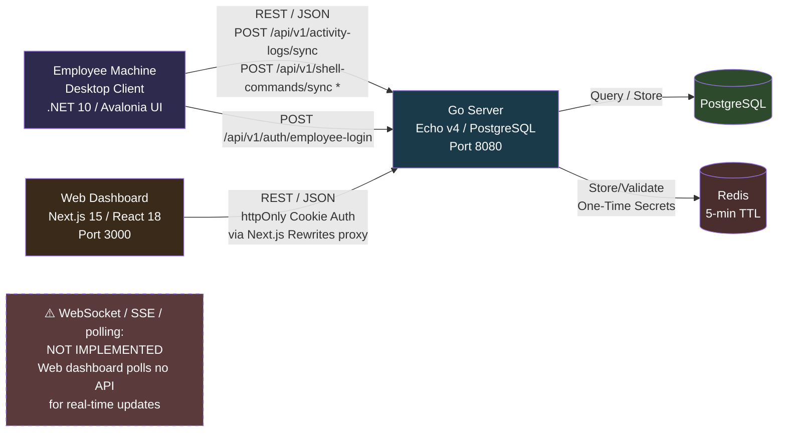

# Alpha AI Tracker — Project Map

> **Last audited:** 2026-07-29 (GNOME-daemon leak blocklisted, Xwayland empty-binary fuzzy-match fixed)  
> **Changelog:** 
> - 2026-07-29: **Fixed GNOME daemon contamination via Xwayland empty binary_name** — Xwayland `.desktop` file has no `Exec=` line, so `InstalledAppDetector` stored it with `binary_name=""`. `GetInstalledAppByBinaryNameFuzzyAsync()` SQL `$name LIKE '%%'` (empty binary) matched every process — causing all GNOME services + Chrome to resolve to the Xwayland entry. Fixed by: (1) `WHERE binary_name != ''` in fuzzy match SQL, (2) `NonAppProcesses` expanded with 16 GNOME daemons + prefix-matching array, (3) `KernelNamePrefixes` in `ProcessFilter.cs` for first-stage filter, (4) `NoDisplay=true` + `Type!=Application` gate in `AddAppFromDesktopFile`. DB cleaned: Xwayland entry patched with proper `binary_name`, orphaned sessions closed, Chrome display names restored.
> - 2026-07-28: **Added browser extension journey tracking** — Chrome MV3 extension (`extensions/chrome/background.js`) captures real-time tab navigations (URL, title, tabId, windowId) via `chrome.tabs.onUpdated/onActivated/onCreated/onRemoved`. Sent through native messaging (`chrome.runtime.connectNative`) → `native-host.py` (Native Messaging stdio bridge) → `NativeMessageService` (Unix socket listener) → SQLite `app_items` as `browser_tab`/`browser_navigation` entries with `url`/`domain` fields.
> - 2026-07-28: **Added `NativeMessageService`** — `BackgroundService` listening on Unix domain socket (`~/.local/share/alpha-ai-tracker/native-messaging.sock`) for browser navigation events. Maintains `_tabSessionCache` mapping `browser:tabId` → `AppSession.Id`. Stores `browser_tab` root items + `browser_navigation` child items per navigation.
> - 2026-07-28: **Added `BrowserExtensionService`** — Detects installed browsers (Chrome, Chromium, Edge, Brave, Opera, Vivaldi, Firefox). Two-strategy extension installation: (1) `--load-extension` with `--no-first-run` for Chromium-based browsers, (2) profile injection via Python SHA256→extension-ID → `Preferences.json` edit as fallback for branded Chrome 150+. Async-safe with `Task.Delay` polling. Extension detection via process monitoring (`pgrep native-host.py + pgrep chrome`) instead of ephemeral socket `fuser`.
> - 2026-07-28: **Added `url`/`domain` columns to `app_items`** — client SQLite schema extended with `url TEXT` and `domain TEXT`. Server-side migrations and DTOs updated. NativeMessageService stores parsed URLs with proper domain extraction.
> - 2026-07-28: **Added `ComputeExtensionId` helper** — runs Python SHA256→a-p alphabet to compute Chrome extension ID from directory path. Used for native messaging manifest `allowed_origins`.
> - 2026-07-28: **Fixed `InstallNativeHostManuallyAsync`** — now computes and includes the extension ID in `allowed_origins` (was empty array, breaking native messaging).
> - 2026-07-28: **Fixed extension active detection** — replaced `IsExtensionConnectedAsync` (socket-based `fuser` which failed because native-host.py only holds ephemeral connections) with `IsExtensionActiveAsync` (process-based `pgrep native-host.py` + `pgrep chrome`). Reliable on all platforms.
> - 2026-07-28: **Removed `--enable-automation` from Chrome launch args** — was triggering GCM errors (`QUOTA_EXCEEDED`, `DEPRECATED_ENDPOINT`) and "controlled by automation" banner. Unnecessary: `--load-extension` works without it on Chromium/Brave/Edge, and branded Chrome 150+ blocks it regardless.
> - 2026-07-28: **Added crash-safe session ended_at tracking** — heartbeat persisted every cycle (`last_heartbeat_at` in `app_status`), stale heartbeat detection on boot, and automatic reconciliation of orphaned sessions with the last heartbeat time as approximate crash time. Includes cross-platform `GetSystemUptime()` for diagnostic logging. Handles poweroff, process crash, and fast restart scenarios.
> - 2026-07-27: Full activity hierarchy engine — PID-persisted sessions, `SessionHierarchyResolver` (node→terminal→IDE), browser `browser_navigation` URL items, file manager `folder`/`file` path items, 30s context dedup cooldown.
> - 2026-07-27: Added `process_id` / `parent_process_id` to `app_sessions` (client SQLite + server migration 010).
> - 2026-07-27: Added `binary_name` to `installed_applications` model/SQLite table for process→display-name mapping.  
> - 2026-07-27: Added `installed_app_id` / `installed_package_id` FK columns to `app_sessions` (client SQLite only).  
> - 2026-07-27: Replaced in-memory `IsInstalledApp()` filter with SQLite-backed `ResolveAppInfo()` — processes not in DB get auto-detected via filesystem heuristics and saved before tracking.  
> - 2026-07-27: Fixed Linux ProcessCollector `resolvedTitle ??= name` bug (was assigning fake titles to all processes, bypassing window-title filter).  
> - 2026-07-27: Added process-tree-based parent-child tracking for terminal shells inside IDE/terminal-emulator sessions (via `ParentItemId` fixup pass).  
> - 2026-07-27: Added `waydroid`/`gnome-software` to `NonAppProcesses` blocklist.  
> - 2026-07-27: `AppDisplayName` now uses the real app name from `installed_applications.app_name` (e.g., "Visual Studio Code"), not the process name ("code") or window title.  
> - 2026-07-27: Removed hardcoded `CommonKnownApps` list from `InstalledAppDetector` — app detection is now 100% dynamic from OS (.desktop files, registry, .app bundles).  
> - 2026-07-27: **Added `BuildToolProcesses` set** — `make`, `go`, `npm`, `npx`, `cargo`, `pip`, `tsc`, `rustc`, etc. Auto-registered as `installed_packages` (category=`tool`) on first sight, tracked without window.
> - 2026-07-27: **Fixed process filter bug** — processes with `appId != null` or `IsBuildTool()` are now tracked even without a window title. Wayland-native apps (VSCode, Chrome) don't appear in X11 window list and were silently dropped.
> - 2026-07-27: **Broadened auto-detect paths** — `/home/*` and `/media/*` now accepted as valid install locations (project-local compiled binaries like `alpha-ai-server` in `./bin/`).
> - 2026-07-27: **Fixed file manager path resolution** — folder display names now resolved to absolute paths by checking `~/`, `~/Documents`, `~/Desktop`, `/media/<user>/`.
> - 2026-07-27: **Fixed `SessionHierarchyResolver`** — PPID walk now traverses build tools and runtimes as intermediate steps; `ShouldLinkTo` accepts build tools as children of IDEs and terminals.
> **Overall completion (honest):** ~42% across all 3 services

---

## 1. Project Overview

Alpha AI Tracker is an employee monitoring and productivity analytics system consisting of three services:

1. **Desktop Client** (`client/`) — Installed on employee machines. Collects process activity, window titles, CPU/memory usage, and shell/terminal commands. Sends data to the central server via REST.
2. **Server** (`server/`) — Go + Echo + PostgreSQL + Redis. Central API hub. Receives and stores client data, exposes admin-facing REST API for the web dashboard. Handles authentication for both web admins and employee desktop clients.
3. **Web Dashboard** (`web/`) — Next.js 15 App Router. Admin-facing UI for viewing employee data, managing departments, generating login secrets, and analytics. Most pages currently render mock localStorage data rather than calling the real API.

---

## 2. System Architecture Diagram



> `*` — `/api/v1/shell-commands/sync` is called by the client but **does not exist** on the server (no route, no table).

---

## 3. Service Breakdown Table

| Service | Stack | Responsibility | Entry Point | Internal Doc |
|---|---|---|---|---|
| **client/** | .NET 10, Avalonia 12.1, CommunityToolkit.Mvvm, Microsoft.Data.Sqlite | Employee-side data collection & sync | `Program.cs`, `App.axaml.cs` | [client/ARCHITECTURE.md](./client/ARCHITECTURE.md) |
| **server/** | Go 1.25, Echo v4.15, pgx v5.10, go-redis v9.21 | Central API hub, data storage, auth | `cmd/server/main.go` | [server/ARCHITECTURE.md](./server/ARCHITECTURE.md) |
| **web/** | Next.js 15.3.4, React 18, Redux Toolkit, TanStack Query | Admin dashboard & analytics | `next.config.ts`, `src/app/layout.tsx` | [web/ARCHITECTURE.md](./web/ARCHITECTURE.md) |

---

## 4. Cross-Service Contracts

### Client ↔ Server

| Direction | Protocol | Auth Method | Format |
|---|---|---|---|
| Employee login (client → server) | REST POST `/api/v1/auth/employee-login` | emp_id + secret_key (Redis-validated) | JSON `{employeeId, secretKey}` → `{employee, token}` |
| Employee disconnect | REST POST `/api/v1/auth/employee-disconnect` | JWT token in body | JSON `{employeeId, token}` |
| Device hardware sync (client → server) | REST POST `/api/v1/device-hardware/sync` | JWT token in request body | JSON `{employeeId, token, entries: [...]}` |
| Installed apps sync (client → server) | REST POST `/api/v1/installed-apps/sync` | JWT token in request body | JSON `{employeeId, token, entries: [...]}` |
| Installed packages sync (client → server) | REST POST `/api/v1/installed-packages/sync` | JWT token in request body | JSON `{employeeId, token, entries: [...]}` |
| Network info sync (client → server) | REST POST `/api/v1/network-info/sync` | JWT token in request body | JSON `{employeeId, token, entries: [...]}` |
| Session events sync (client → server) | REST POST `/api/v1/session-events/sync` | JWT token in request body | JSON `{employeeId, token, entries: [...]}` |
| App sessions sync (client → server) | REST POST `/api/v1/app-sessions/sync` | JWT token in request body | JSON `{employeeId, token, entries: [...]}` |
| App items sync (client → server) | REST POST `/api/v1/app-items/sync` | JWT token in request body | JSON `{employeeId, token, entries: [...]}` |

### Server ↔ Web

| Direction | Protocol | Auth Method | Format |
|---|---|---|---|
| Web admin login | REST POST `/api/v1/auth/login` | email + password → httpOnly cookie | JSON `{email, password}` → sets cookie |
| All web API calls | REST via Next.js rewrites (`/api/*` proxy) | httpOnly cookie (auto-sent) | JSON request/response |

### Contract Documentation

**No formal contract documentation exists** beyond what is implicit in the Go DTO files (`server/internal/dto/`) and the TypeScript API client (`web/src/lib/api.ts`). These are manually kept in sync by the developer — there is no schema generation, OpenAPI spec, or shared type system.

### Inconsistencies Found

1. **Shell commands REMOVED** — Shell command collection/sync removed from client. No endpoint exists on server. All related Go/C# code removed.
2. **Old child tables removed** — `browser_contexts`, `file_explorer_contexts`, `urls`, `url_visits` tables and all Go/C# code replaced by single generic `app_items` table.
3. **Employee disconnect** — Client sends `POST /api/v1/auth/employee-disconnect` with `{employeeId, token}`, route exists on server.
4. **activity_logs removed** — The old `activity_logs` table (server Postgres + client SQLite) and all Go/C# code referencing it have been removed. Replaced by relational `app_sessions`.
5. **Field naming** — Client uses `employeeId` in snake_case for the auth payload, server expects `employeeId` too (consistent). Activity log entries: client sends `processName`, `windowTitle`, etc. (camelCase), server DTO matches. **Consistent by convention, no validation schema enforces it.**

---

## 5. Current Completion State

### Server — ~50% complete

**What works:**
- Migrations 001-010 run on startup (010 adds `process_id`/`parent_process_id` on app_sessions)
- Full CRUD for users, employees, departments
- Web admin auth (email/password → httpOnly cookie with encrypted JWT)
- Employee auth (Redis one-time secret → JWT token)
- 8 ingestion endpoints: device_hardware, installed_apps, installed_packages, network_info, session_events, app_sessions, app_items (+ synced_at for all)
- App sessions + app items listing with filtering/pagination
- Company admin auto-initialization on first run
- Graceful shutdown

**What's missing:**
- **No tests** (0 test files)
- **No rate limiting** on any endpoint (including login)
- **No structured logging** — uses `log.Printf` only
- **No Redis fallback** — if Redis is down, employee auth is completely broken
- **No observability** — no metrics, tracing, health check depth
- **No request validation library** — manual field checks in handlers
- **No cleanup job** for old data (grows unbounded)
- **Old browser_contexts/file_explorer_contexts/urls/url_visits code removed** — replaced by app_items

### Client — ~69% complete

**What works:**
- Cross-platform process collection (Win/Linux/macOS)
- **Crash-safe session ended_at tracking** — heartbeat persisted every cycle, stale heartbeat detection on boot closes orphaned sessions with approximate crash time. Handles poweroff, process crash, and fast restart.
- SQLite local storage with relational schema (device_hw, installed_apps, network, session_events, app_sessions, app_items)
- **PID-based session tracking** with `process_id` / `parent_process_id` on `app_sessions`
- **Hierarchy resolver**: node/bash → terminal → IDE via `parent_item_id` + OS process tree
- **Build tool tracking**: `make`, `go`, `npm`, `npx`, `cargo`, `pip`, `tsc` etc. auto-registered as packages and tracked (no window required); parent-linked to terminal → IDE
- **Wayland-native app tracking**: known GUI apps (VSCode, Chrome) tracked even without a window title — they don't appear in X11's `_NET_CLIENT_LIST` on Wayland
- **Browser context**: `browser_tab` + `browser_navigation` items (URL from title / domain heuristic)
- **File explorer context**: `folder` + `file` items; folder display names resolved to absolute paths via filesystem search
- **Runtime auto-register**: `node`, `python3`, etc. auto-added to `installed_packages` when seen running
- Models: DeviceHardwareInfo (with mac/gpu/storage), InstalledApplication (with metadata + binary_name), NetworkInfo (with public IP), SessionEvent, AppSession (with FK to installed_apps/packages), AppItem (self-referencing via parent_item_id)
- Encrypted config system (AES-256-GCM, transport→machine key migration)
- Login/logout flow with server
- Batched sync engine (every ~5 min, FK-ordered, 500-row batches, stop-on-failure per table)
- **Device hardware**: now collects mac_address, storage_devices, gpu_model from OS
- **Installed apps**: scans actual OS databases (registry, .desktop files, .app bundles) — GUI apps only, not running processes; binary_name mapping extracted from Exec= line
- **Installed packages**: detects CLI tools/runtimes/libraries from npm/pip/apt/brew/choco/winget/scoop/cargo/snap/flatpak — separate table from installed_applications
- **Network info**: has public IP lookup, dedup by IP change, mac_address removed (in device_hw)
- **Shell commands REMOVED** — no longer collected or synced
- **Generic app_items** replaces browser_contexts + file_explorer_contexts + urls + url_visits
- **Process filtering**: SQLite-backed ResolveAppInfo() replaces in-memory IsInstalledApp() — processes not in DB auto-detected and saved before tracking
- **AppDisplayName**: uses real app name from installed_applications (e.g., "Visual Studio Code"), not process name ("code") or window title
- **Parent-child tracking**: `SessionHierarchyResolver` walks PPID chain + open-session PID registry; links via `parent_item_id` (nullable for standalone terminals)
- **Linux filtering fixed**: removed resolvedTitle ??= name fallback that was bypassing window-title filters
- **GNOME daemon contamination fixed**: Xwayland empty `binary_name` caused fuzzy-match SQL `$name LIKE '%%'` to match every process. Fixed via: `WHERE binary_name != ''` in fuzzy SQL, `NonAppProcesses` + `NonAppProcessPrefixes` blocklist expansion (16 GNOME daemons), `KernelNamePrefixes` in first-stage filter, `NoDisplay=true` + `Type!=Application` gate in `.desktop` file parsing
- Auto-start persistence (all platforms)
- Background guard watchdog
- Tray icon (minimize to tray on close)
- Windows power management (prevents sleep)

**What's missing:**
- **No tests** (0 test files)
- **No auto-update mechanism**
- **No crash reporting** — unhandled exceptions crash silently
- **No offline queue analysis** — if server is unreachable, logs buffer locally with no back-pressure handling
- **No encryption at rest** — SQLite encryption (sqlcipher) is commented out
- **macOS CPU measurement** — macOS process collector skips CPU measurement (always 0%)
- **macOS window titles** — only captures foreground window
- **Improved Chrome subprocess filtering** — should check `/proc/<pid>/cmdline` for `--type=` to filter renderer/zygote reliably

### Web — ~16% complete

**What works:**
- ~30 page routes exist with polished UI
- Login page with animated hero section
- Auth check on mount (Redux + server cookie)
- Users page — real API calls via TanStack Query (CRUD + generate secret)
- Departments page — real API calls (CRUD)
- Logs/Comprehensive page — real API calls (now using new app_sessions API)
- Sidebar with permission-based filtering (client-side only)
- Dashboard shows mock stats and chart

**What's missing (most pages):**
- **~25 of 30+ pages use mock localStorage data** — not connected to real API
- **Client-side only permissions** — no server enforcement
- **No error boundaries** — uncaught React errors crash the page
- **No loading/empty/error states** on most mock-data pages
- **No real-time updates** — no polling, WebSocket, or SSE
- **No accessibility testing** — many interactive elements lack aria attributes
- **No unit tests** — 0 test files
- **GitHub release download** fetches from `clickmaster4285/Alpha-AI-Tracker`, not the org repo

---

## 6. Global Conventions

*Extracted from observed patterns, not documented anywhere:*

| Convention | Observed Pattern |
|---|---|
| **API versioning** | All routes under `/api/v1` |
| **Error responses** | `{code, message, detail?}` via `dto.APIError` (server) |
| **Auth** | httpOnly cookies for web, JWT in request body for employee clients |
| **Naming (Go)** | PascalCase exports, camelCase JSON fields |
| **Naming (TypeScript)** | camelCase variables, PascalCase components |
| **Naming (C#)** | PascalCase for classes/methods, `_camelCase` for private fields |
| **Soft delete** | `deleted_at TIMESTAMPTZ` on all tables, filtered in queries |
| **Migrations** | Sequential numbered SQL files in `server/migrations/` |
| **Go module** | `github.com/alpha-ai-tracker/server` |
| **Git branch** | Currently on `setup` branch — no PR/branch convention visible |
| **Commit style** | Descriptive lowercase messages: "now remove the exit btn on the tray on windows", "fixit" |
| **Monorepo tooling** | No shared tooling (no Turborepo, Nx, etc.). Each service has its own build system. |

---

## 7. Known Gaps / Risks

### Cross-Cutting

| Gap | Severity | Details |
|---|---|---|
| **Shell commands sync** | 🔴 High | Client sends to non-existent endpoint. Shell command data is lost forever. |
| **No tests anywhere** | 🔴 High | 0 test files across all 3 projects. Any refactor is blind. |
| **No observability** | 🟠 Medium | No structured logging, metrics, tracing. Debugging production issues requires SSH + log scraping. |
| **Client-side only RBAC** | 🟠 Medium | Permissions are enforced only in the web frontend localStorage. A malicious user can trivially bypass them. |
| **No rate limiting** | 🟠 Medium | Login endpoint and all sync endpoints have no rate limiting. Brute-force / DoS is trivial. |
| **Mock data dominance** | 🟠 Medium | ~90% of web pages use mock data, giving a false sense of completeness. |
| **Default passwords** | 🟠 Medium | `AlphaAI@2024!` is the compiled-in default. Easy to forget to change. |
| **No offline/retry strategy** | 🟢 Low | Client retries sync every cycle but has no exponential backoff or dedup. |
| **activity_logs REMOVED** | 🟢 Low | `activity_logs` table (Postgres + SQLite) and all Go/C# code removed. Migration 006 drops the table with no rollback. The web comprehensive page now queries `app_sessions`. |
| **Horizontal scaling** | 🟢 Low | Server uses Redis for employee secrets (short TTL), so scaling is straightforward — but DB queries have no query analysis. |

---

## 8. How to Run Locally

### Prerequisites

- Go 1.22+ (tested 1.25), PostgreSQL 16+, Redis 7+
- Node.js 20+, npm
- .NET 10 SDK (for client development with `dotnet run`)
- Docker (optional, for PostgreSQL/Redis)

### 1. Start PostgreSQL and Redis

```bash
# Using Docker (recommended)
docker run -d --name pg -e POSTGRES_USER=alpha_ai -e POSTGRES_PASSWORD=yourpassword -e POSTGRES_DB=alpha_ai_tracker -p 5432:5432 postgres:16
docker run -d --name redis -p 6379:6379 redis:7
```

### 2. Server

```bash
cd server
cp .env.example .env
# Edit .env — set DB_PASSWORD and JWT_SECRET
make setup
make run
# Server starts on http://localhost:8080
```

### 3. Web Dashboard

```bash
cd web
npm install
npm run dev
# Dev server on http://localhost:3000
```

If server runs on a different host, set `NEXT_PUBLIC_API_URL` in `web/.env`.

### 4. Desktop Client

```bash
cd client
# Ensure .env has ALPHA_SERVER_URL=http://localhost:8080
dotnet run
```

### Notes

- No `docker-compose.yml` exists — you must start PostgreSQL and Redis manually.
- The client requires a running server with at least one employee created via the web admin.
- Login to the web dashboard with the default credentials from `.env` (admin@alphai.com / AlphaAI@2024!).
