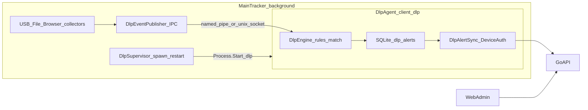
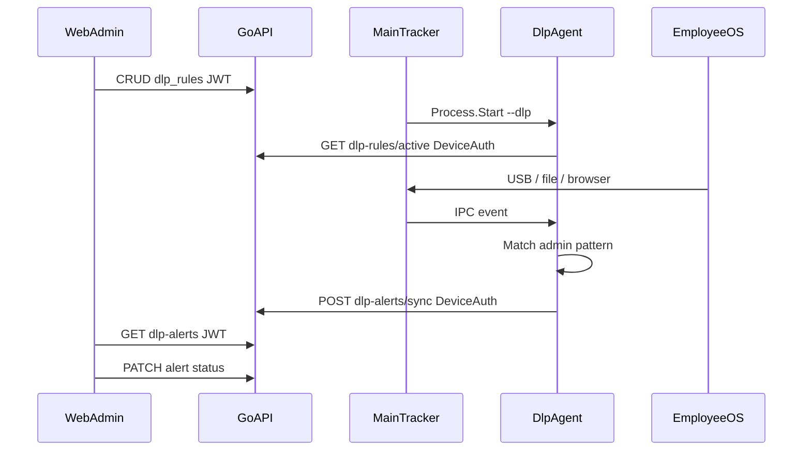

# DLP Full Workflow Plan

Aligned with [`prompt.md`](prompt.md) and [`AGENTS.md`](AGENTS.md).

**v1 defaults:** Alert Only; channels **USB**, **File Transfer**, **Cloud Upload**; **Email deferred**. Patterns are admin-configured only ([No-Hardcoded-Names Rule](AGENTS.md)).

**Process model (locked):** DLP runs as a **separate long-running process** under the client — same binary, `client.exe --dlp` (or `client --dlp`), mirroring the existing [`--terms`](client/Program.cs) agent pattern. The main tracker does **not** evaluate DLP rules in-process.

**On execute:** save this body to [`plan.md`](plan.md), then implement; do not commit/push unless the user asks.

---

## Classification ([prompt.md](prompt.md) operating contract)

**Implement/build** across `server/` + `client/` + `web/`. Contract sync: migration → model → DTO → repo → service → handler → `api.ts` → pages. Client adds a second process entry + supervisor + IPC.

---

## Current state (evidence)

- Web mocks: [`dlp-alerts/page.tsx`](web/src/app/(app)/dlp-alerts/page.tsx), [`dlp-rules/page.tsx`](web/src/app/(app)/dlp-rules/page.tsx)
- RBAC: `security-dlp` / `dlp-alerts` / `dlp-rules`
- No DLP tables/APIs/engine
- Precedent for second process: `client.exe --terms` → [`RunTermsAgentAsync`](client/Program.cs) + [`TermsService.SpawnTermsAgent`](client/Services/TermsService.cs) + mutex `AppMutex + "-terms-agent"` (terms exits after accept; **DLP stays alive**)
- Feeders stay in the **main** tracker: USB, file journey, browser a11y
- Next migration: **`044_dlp.sql`**

---

## Process architecture (separate instance)

### Locked design

| Piece | Decision |
|-------|----------|
| Binary | Same `client` / `client.exe` — **no new installer asset** |
| Entry | Early `args.Contains("--dlp")` → `RunDlpAgentAsync` then `return` (before main AppMutex), like `--terms` |
| Mutex | `AppInfo.AppMutex + "-dlp-agent"` — one DLP agent; does **not** take the main tracker mutex |
| Supervisor | Main tracker hosted `DlpSupervisor`: if `ALPHA_DLP_ENABLED` and employee logged in, spawn `{exe} --dlp`; poll/restart if process exits; stop agent on tracker shutdown |
| Sensors | Remain in **main** process (avoid second a11y poller / duplicate USB watchers) |
| IPC | Main publishes compact events (`usb_plugged`, `file_on_removable`, `browser_url`) to a local endpoint under user data dir (Windows named pipe or Unix socket — same family as native-messaging sock); DLP agent is the sole consumer |
| Rules + sync | **Only** in DLP agent: `GET /dlp-rules/active`, match, write local `dlp_alerts`, `POST /dlp-alerts/sync` with Device token from shared SQLite `employee_info` |
| SQLite | Shared DB (WAL already); DLP agent uses gated writes for `dlp_alerts` only; main continues existing writers. Follow existing busy_timeout / semaphore patterns |
| GUI | DLP agent is **headless** (no Avalonia window) — unlike `--terms` |
| Auth token | Read device/employee credentials from the same local store the tracker uses (no second login) |

### Day-to-day flow

1. **Admin** CRUD rules on `/dlp-rules` (JWT).
2. **Main tracker** starts → `DlpSupervisor` launches `--dlp` when enabled + credentials present.
3. **DLP agent** pulls active rules (DeviceAuth), listens on IPC.
4. **Main** collectors emit USB / removable-file / browser-URL events over IPC (payload carries path/url/device metadata — matching still uses admin `pattern` only).
5. **DLP agent** matches → local alert → sync → server.
6. **Admin** triages `/dlp-alerts`.

---

## Full product workflow (sequence)

---

## AGENTS.md / prompt.md rule checklist

| Rule | How DLP complies |
|------|------------------|
| **Client-vs-Web Auth Separation** | Agent: DeviceAuth active + sync. Admin: JWT CRUD/list/PATCH. |
| **Web Infinite-Scroll / URL filters** | `/dlp-alerts` live list per existing rules; Suspense; no router-in-setState. |
| **No-Hardcoded-Names** | Admin `pattern` + structural removable/USB signals in publisher; no cloud vendor lists. |
| **Installer-Parity** | Same binary + `--dlp`; `ALPHA_DLP_ENABLED` (+ optional IPC path knobs) in `.env` before `encrypt-config.sh`; re-bake `config.enc`; verify **two processes** from installed build. |
| **Cross-platform analyzer safety** | OS guards inside platform IPC/sensor publish paths; no `[SupportedOSPlatform]` on hosted graphs. |
| **Installed paths** | IPC socket/pipe name + DLP logs under user config/data dirs — never install dir. |
| **Single-instance** | DLP uses **separate** mutex; must not steal/block main tracker SHOW mutex. |
| **Contract + docs** | ARCHITECTURE + AGENTS changelog document the agent process. |
| **Safety** | No unsolicited commit/push; preserve unrelated work. |

---

## Data model (`044_dlp.sql`)

**`dlp_rules`:** `id`, `name`, `trigger`, `pattern`, `action` DEFAULT `alert_only`, `severity`, `enabled`, `apply_to_all`, soft delete, timestamps.

**`dlp_rule_departments`:** (`rule_id`, `department_id`).

**`dlp_alerts`:** client-minted UUID upsert, `employee_id`, `device_id`, `rule_id`, `trigger`, `severity`, `status` DEFAULT `open`, `file_or_url`, `detail_json`, `assigned_to`, `notes`, `event_at`, `synced_at NOT NULL DEFAULT now()`, soft delete.

Indexes: `(status, event_at DESC)`, `(employee_id, event_at DESC)`, `(rule_id)`.

Client SQLite: `dlp_alerts` + `is_synced` / `synced_at` (MigrateSql ALTERs as needed).

---

## API surface

| Consumer | Method | Path | Auth |
|----------|--------|------|------|
| DLP agent | GET | `/api/v1/dlp-rules/active` | DeviceAuth |
| DLP agent | POST | `/api/v1/dlp-alerts/sync` | DeviceAuth |
| Admin | CRUD | `/api/v1/dlp-rules` | JWTAuth |
| Admin | GET | `/api/v1/dlp-alerts` | JWTAuth + filters/pagination |
| Admin | PATCH | `/api/v1/dlp-alerts/:id` | JWTAuth |

Main tracker **does not** call these DLP endpoints (supervisor + IPC only).

---

## Client implementation map

| Component | Role |
|-----------|------|
| [`Program.cs`](client/Program.cs) | `--dlp` → `RunDlpAgentAsync` (lean Host: logging, config, store, HTTP, `DlpEngine`, IPC server/client listener, alert sync loop) |
| `DlpSupervisor` | Hosted in **main** DI; spawn/monitor/kill `--dlp`; gated by `ALPHA_DLP_ENABLED` |
| `DlpEventPublisher` | Main-side hooks after USB insert / removable file journey / browser URL — fire-and-forget IPC write |
| `DlpEngine` | Agent-side: rule cache, match, insert alert, mark sync |
| `DlpAlertSync` | Agent-side drain (byte/row bounded like SyncService, or thin dedicated loop — **only** `dlp_alerts`) |
| Mutex | `AppMutex + "-dlp-agent"` |
| Env | `ALPHA_DLP_ENABLED` (default true); optional `ALPHA_DLP_IPC_NAME` if needed — Installer-Parity |

`--print-config` should print DLP + IPC settings.

---

## Web implementation notes

- [`api.ts`](web/src/lib/api.ts): `dlpRulesApi`, `dlpAlertsApi`
- Replace mocks; EmptyState; infinite scroll + URL filters; rules CRUD
- RBAC keys unchanged

---

## Execution workflow ([prompt.md](prompt.md))

1. Preflight branch/tree; read AGENTS + relevant ARCHITECTURE.
2. `044` + server APIs.
3. `--dlp` agent host + supervisor + IPC + engine (before wiring all three channels).
4. Live web pages.
5. Verify two OS processes; sync path; docs handoff.
6. Report tiers: source / installer / installed.

### Delivery phases

| Phase | Scope | Outcome |
|-------|--------|---------|
| **0** | `plan.md` + `044` + empty admin APIs | EmptyState pages |
| **1a** | `--dlp` process + supervisor + rules pull | Second process alive; rules cached |
| **1b** | IPC + USB + browser URL match → alert sync | Real alerts |
| **1c** | Removable file-transfer events | File channel |
| **2** | Email | Separate design |
| **3** | Block | OS policy spike |

---

## Verification

| Tier | Proof |
|------|--------|
| **Source** | `go build`/`vet`/tests; `dotnet build`; `tsc`/`next build` |
| **Process** | With tracker running: second process command line contains `--dlp`; killing agent → supervisor restarts; disabling `ALPHA_DLP_ENABLED` → no agent |
| **Installer** | Build installer when config changes; re-bake `config.enc` |
| **Installed** | Installed artifact shows supervisor + agent; rule → event → `/dlp-alerts` → PATCH |

---

## Out of scope for v1

- In-process DLP engine inside the main tracker (explicitly rejected — agent process only)
- Separate DLP `.exe` / second install package
- True Block; Email; clipboard; hardcoded cloud vendor lists
- DLP agent Avalonia UI

---

## Definition of done ([prompt.md](prompt.md))

1. DLP v1 works **in the `--dlp` process**, supervised by the main client.
2. Checks pass with honest tiers; two-process proof included.
3. Contracts + `config.enc` / installer implications handled.
4. Unrelated work preserved; no unsolicited git ops.
5. Final report + `plan.md` / ARCHITECTURE / `AGENTS.md` updated.
