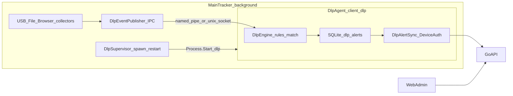

# DLP Full Workflow Plan

Aligned with `prompt.md` and `AGENTS.md`.

**v1 defaults:** Alert Only; channels **USB**, **File Transfer**, **Cloud Upload**; **Email deferred**. Patterns are admin-configured only (No-Hardcoded-Names Rule).

**Process model (locked):** DLP runs as a **separate long-running process** under the client — same binary, `client.exe --dlp` (or `client --dlp`), mirroring the existing `--terms` agent pattern. The main tracker does **not** evaluate DLP rules in-process.

---

## Classification

**Implement/build** across `server/` + `client/` + `web/`. Contract sync: migration → model → DTO → repo → service → handler → `api.ts` → pages. Client adds a second process entry + supervisor + IPC.

---

## Process architecture (separate instance)

### Locked design

| Piece | Decision |
|-------|----------|
| Binary | Same `client` / `client.exe` — **no new installer asset** |
| Entry | Early `args.Contains("--dlp")` → `RunDlpAgentAsync` then `return` (before main AppMutex), like `--terms` |
| Mutex | `AppInfo.AppMutex + "-dlp-agent"` — one DLP agent; does **not** take the main tracker mutex |
| Supervisor | Main tracker hosted `DlpSupervisor`: if `ALPHA_DLP_ENABLED` and employee logged in, spawn `{exe} --dlp`; poll/restart if process exits; stop agent on tracker shutdown |
| Sensors | Remain in **main** process (avoid second a11y poller / duplicate USB watchers) |
| IPC | Main publishes compact events (`usb_plugged`, `file_on_removable`, `browser_url`) to a local endpoint under user data dir; DLP agent is the sole consumer |
| Rules + sync | **Only** in DLP agent: `GET /dlp-rules/active`, match, write local `dlp_alerts`, `POST /dlp-alerts/sync` with Device token from shared SQLite `employee_info` |
| SQLite | Shared DB (WAL); DLP agent uses gated writes for `dlp_alerts` only |
| GUI | DLP agent is **headless** (no Avalonia window) |
| Auth token | Read device/employee credentials from the same local store (no second login) |

---

## API surface

| Consumer | Method | Path | Auth |
|----------|--------|------|------|
| DLP agent | GET | `/api/v1/dlp-rules/active` | DeviceAuth |
| DLP agent | POST | `/api/v1/dlp-alerts/sync` | DeviceAuth |
| Admin | CRUD | `/api/v1/dlp-rules` | JWTAuth |
| Admin | GET | `/api/v1/dlp-alerts` | JWTAuth + filters/pagination |
| Admin | PATCH | `/api/v1/dlp-alerts/:id` | JWTAuth |

Migration: `044_dlp.sql` (`dlp_rules`, `dlp_rule_departments`, `dlp_alerts`).

---

## Client map

| Component | Role |
|-----------|------|
| `Program.cs` | `--dlp` → `RunDlpAgentAsync` lean Host |
| `DlpSupervisor` | Main DI: spawn/monitor/kill `--dlp` |
| `DlpEventPublisher` | Main: USB / removable file / browser URL → IPC |
| `DlpEngine` | Agent: rule cache, match, insert alert |
| `DlpAlertSync` | Agent: drain `dlp_alerts` only |
| Env | `ALPHA_DLP_ENABLED` (default true); optional `ALPHA_DLP_IPC_NAME` |

---

## Out of scope for v1

- In-process DLP engine; separate DLP `.exe`; true Block; Email; clipboard; hardcoded cloud vendor lists; DLP Avalonia UI
